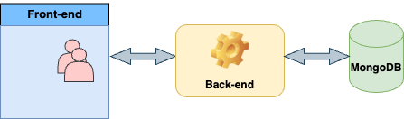

# Design Document
- [Design Document](#design-document)
  - [Introduction](#introduction)
  - [Use Cases](#use-cases)
  - [Design for Requirements](#design-for-requirements)
  - [Architecture](#architecture)
  - [Implementation Design](#implementation-design)
  - [Detailed design of the component(s) prioritised for a prototype](#detailed-design-of-the-components-prioritised-for-a-prototype)
  - [Requirements including methodology choice, priorisation and sourcing](#requirements-including-methodology-choice-priorisation-and-sourcing)
  - [Testing Plan](#testing-plan)
   

## Introduction
This document describes the architecture and system design for the project, which aims to process, analyze, and visualize data from academic papers automatically. The application accepts papers in different kinds of formats, has the capability to extract information from them, and visualize the results depending on the information that the user queries.

The purpose of this document is to outline the technical aspects of all features meeting the requirements, including the implementation of those developed with specific techniques. Also, the plan is to test all features at different levels.

## Use Cases

### 1. User Registration

- **Use Case ID**: UC001
- **Use case name**: User registration
- **Participant**: All users
- **Precondition**: The user accesses the system but has not registered yet.
- **Main Event Flow**:
    - The user chooses to register.
    - The user is prompted to enter their username, password, and email address.
    - The user submits registration information.
    - The system verifies the uniqueness and validity of the registration information.
    - The system creates a new user account with hashed password and notifies the user that the registration is successful.
- **Alternative Event Flow**:
   - If the username already exists in the information submitted by the user, which means that user has already existed, then the system will prompt an error and ask the user to choose another username.
- **Post-condition**: The user successfully registers and can log in to the system using the username and password.
- **Business Rules**:
   - Username must be unique.
   - Password must meet security requirements.

### 2. User Login

- **Use Case ID**: UC002
- **Use case name**: User login
- **Participant**: Registered users
- **Prerequisite**: The user has been registered.
- **Main Event Flow**:
    - The user chooses to log in.
    - The system prompts the user to enter their username and password.
    - The user submits login information.
    - The system verifies user information.
    - The system grants the user access rights with different levels of capabilities (admin, manager, user)
      - Admin: upload resources, manage resources, manage users
      - Manager: upload resources, manage resources
      - User: upload resouces, manage resources uploaded by user's own
- **Alternative Event Flow**:
   - If the username or password is incorrect, the system prompts that the login failed and allows the user to try again.
   - Or the system recommends the user to register a account
- **Post-condition**: The user successfully logs in to the system and can access protected resources.
- **Business Rules**:
   - Users must provide valid registration information to log in.

### 3. Upload Articles

- **Use Case ID**: UC003
- **Use case name**: Upload article
- **Participant**: Registered user with any capavility
- **Precondition**: The user is logged in.
- **Main Event Flow**:
    - The user chooses to upload article files.
    - The system prompts the user to enter or upload the details of the article, including title, author, and article size.
    - Users submit article files.
    - The system processes and stores article information.
    - The system notifies the user that the article information has been uploaded successfully.
- **Alternative Event Flow**:
   - If the article information is incomplete or has an incorrect format, the system prompts an error and requires the user to correct it.
- **Postcondition**: The article information is successfully submitted and stored in the system.
- **Business Rules**:
   - All submitted article information must be in PDF or DOC format.


### 4. Search Articles

- **Use Case ID**: UC004
- **Use case name**: Search articles
- **Participant**: Registered User/Visitor
- **Precondition**: The user accesses the system.
- **Main Event Flow**:
    - The user enters search criteria and select a category (Title/DOI, keyword, author)
    - The system retrieves articles based on the entered search criteria and generates a graph based on the information provided by the user.
    - The system displays the search results list and the graph.
- **Alternative Event Flow**:
   - If no matching article is found, the system displays a No Results Found message.
- **Post-condition**: Users can see the search results and select articles of interest to view detailed information.
- **Business Rules**:
   - Search can be done without user login.

## Design for Requirements

### 1. Introduction

Our text analysis system is carefully designed to ensure that every design element directly aligns with our clear project goals and requirements. This section illustrates the careful alignment of our design choices with the functional and non-functional requirements of the project, illustrating a coherent roadmap from requirements to implementation.

### 2. Design Overview

#### **(1) Data Processing Framework**

**Design Goal:** Create a powerful framework that can quickly and accurately organize large amounts of data.

**Requirements Fulfilment:** 

- **Data Reading Capability(DI-FR-01)** 
    - **Requirements:** The framework should be able to extract author, publication date, title, citation and keywords from a given PDF or link.
    - **Design Decision:** Implemented a specific data parsing service that uses NLP techniques such as the rakun2 library to process PDF files and web content, ensuring that the required information is accurately extracted from various formats.

- **Preprocessing Capability(DI-FR-02)**
    - **Requirements:** The system must handle missing values, duplicate data, and wrong data types in ingested papers.
    - **Design Decision:** Introduce a data cleaning module and use machine learning algorithms to automatically identify and correct erroneous data types.

- **Data Verification (DI-FR-03)**
     - **Requirements:** Check whether the extracted text fields are complete and whether dates and numbers have a consistent format.
     - **Design Decision:** Design a post-processing step that uses regular expressions and custom validation rules to ensure format consistency.

#### **(2) Text Analysis Technology**

 **Design Goal:** Use NLP technology to deeply analyze academic papers and reveal hidden connections between authors, keywords, core arguments, and cited documents.

**Requirements Fulfilment:** 

- **Author Relationship Analysis (DA-FR-02)**
     - **Requirements:** Create a data model that maps the relationship between each paper and its authors, as well as the author collaboration network.
     - **Design Decision:** Query and search relevant data from the database, then analyze the found data and create a network diagram.

- **Paper Citation Analysis (DA-FR-03)**
     - **Requirements:** Analyze the citation relationship between papers and identify the most frequently cited papers and core authors.
     - **Design Decision:** Implemented a citation parsing engine that builds paper citation networks and applies centrality analysis to highlight key papers and authors.

- **Topic Cluster Analysis (DA-FR-04)**
     - **Requirement:** Group documents based on keywords.
     - **Design Decision:** Can use the LDA (Latent Dirichlet Allocation) algorithm for topic modeling, automatically identify hidden topics in the document set, and classify documents according to these topics.

- **Sentiment Analysis (DA-FR-05)**
     - **Requirements:** The system should be able to analyze positive/negative sentiments in literature.
     - **Design Decision:** Introduce a sentiment analysis library (such as VADER or TextBlob) to evaluate the emotional tendency of the document and help users understand the emotional color of the document.


#### **(3) Data Visualization Interface**

 **Design Goal:** Develop an intuitive and interactive data visualization interface to display analysis results in a direct way and provide users with convenient manipulation.

**Requirements Fulfilment:** 

- **Intuitive Navigation Structure (DV-FR-01)**
     - **Requirement:** Design clear menus and navigation elements to ensure users can easily find and access data.
     - **Design Decision:** Adopt user-friendly UI/UX design principles, making information retrieval simple and direct through a concise and clear interface layout and intuitive navigation design.

- **Diverse Data Visualization Components (DV-FR-02)**
     - **Requirements:** Provide data visualization charts, such as network diagrams and column charts, to adapt to different types of data display needs.
     - **Design Decision:** Integrated Bokeh library, which supports a wide range of chart types and customization options to enrich the way data is presented.

- **Interactive Interface (DV-FR-03)**
     - **Requirement:** Ensure charts and graphs are interactive, such as allowing users to zoom in/out, filter data, or view details of specific data.
     - **Design Decision:** Use front-end React technology and Next.js framework to develop dynamic interactive elements and implement interactive functions of charts to enhance user experience.

- **Compatibility Design (DV-FR-04)**
     - **Requirements:** Ensure that the user interface of interactive functions can be used normally on different devices (such as tablets and mobile phones), and that charts can be displayed normally, so that users can use them in different physical environments (such as home or office) All feel convenient.
     - **Design Decision:** Use responsive design principles to ensure that interface layout and functionality remain usable and accessible across a variety of screen sizes and resolutions. At the same time, compatibility testing ensures that all interactive and visual components behave consistently on mainstream browsers and devices.


## Architecture
There are several architectures fitting into the application we want to implement. We chose `three-tier architecture` to architect the application with separate front-end and back-end components, along with a database connected to the back-end exclusively.

With these three layers, we implement the project briefly handling
- Front-end: the presentation layer, also called the user interface
- Back-end: the application logic layer
- Database: the data storage layer

The relationship also can be illustrated below:



### 1. Front-end Layer
This tier is the user interface and communication layer of the application, where users interact with the application. It responds and displays information based on the actions made by users.

This project is designed to be a web application with three main pages, the home page, search result page, and user dashboard. React.js and Next.js will be used to create a responsive, dynamic user interface. With the help of Next.js, the application could have better performance on server-side rendering, and the SEO will be optimized. And the interface is styled by Tailwind CSS as well. Besides, ESLint should be introduced to enforce coding standards and detect syntax errors and code styles.


Besides, the complexity and data-driven nature of our paper analysis application necessitates the incorporation of state management solutions to handle user interactions and data efficiently across the application. By leveraging React's Context API or more sophisticated state management libraries like Redux, we ensure that search queries, results, and user preferences are seamlessly managed and persisted throughout the user session. This approach not only enhances the user experience by providing a responsive and state-aware application but also simplifies the development and maintenance of the application's complex data flows. Through these integrated technologies and practices, the front-end layer is optimized to meet the unique demands of presenting and interacting with academic data, ensuring that users have a powerful tool at their disposal for discovering and analyzing research papers.


### 2. Back-end Layer

The backend gets the requests from the frontend layer, then processes them calling the functions respectively, including interacting with the database.

The main programming language to implement the backend is Python, which is applicable for fast-paced development due to its readability and versatility. To build the API that can be called from the frontend layer, FastAPI is introduced. Thus, the backend benefits from asynchronous request handling, to ensure that the web server can handle a large number of concurrent requests efficiently.

Moreover, the logical process of documents should be dealt with some libraries that can extract the information, summarize the content, and preprocess data before uploading to the database.

### 3. DB Layer

This layer serves as the foundation for data storage and retrieval in our application, meticulously archiving and managing the wealth of academic papers, articles, user data, and their interconnected relationships. The database layer is crucial for ensuring that the backend layer can efficiently access, update, and manipulate data based on the requests initiated by the front-end layer.

In the context of our application, MongoDB will store information about academic papers, including titles, DOIs, abstracts, authorship, citation details, and keyword associations. This data structure facilitates efficient data retrieval for generating graphs and clustering articles based on related keywords or citations. The database is exclusively connected to the back-end, ensuring secure and reliable data transactions.

## Implementation Design

### 1. DB Design

This project uses MongoDB as the database management system and defines four main models: Article, Graph, Input, and User. These models are designed to support the core functionality of the project, including storage and retrieval of article information, user authentication, file upload processing, and visual display of search results.

#### **(1) Article Model**

The Article model is used to store detailed information of academic articles, including author, publication date, citation information and other data.

- **Collection name**: Articles
- **Field**:
    - `doi`: unique identifier of the article (string type).
    - `title`: article title (string type).
    - `published_date`: The publication date of the article (datetime type).
    - `authors`: List of article authors, each author includes name and affiliation (nested document list).
    - `citations`: List of DOIs cited by the article (string list type).
    - `citation_count`: The number of times the article has been cited (integer type).
    - `retracted`: Flag indicating whether the article has been retracted (Boolean type).
    - `affiliation`: List of affiliations of the article author (string list type).
    - `abstract`: article abstract (string type).
    - `keywords`: Article keyword list (string list type).

#### **(2) Graph Model**

The Graph model is used to store the scripts and data required to generate charts for visual display on the front end.

- **Collection name**: Graphs
- **Field**:
   - `script`: The script required to generate the chart (string type).
   - `plot`: the data or content of the chart (string type).

#### **(3) Input Model**

The Input model is used to record DOI lists uploaded by users or directly entered for article query and processing.

- **Collection name**: Inputs
- **Field**:
   - `dois`: DOI list input by the user (string list type).

#### **(4) User Model**

The User model is responsible for managing user account information, including username, password, and email.

- **Collection name**: Users
- **Field**:
   - `username`: The user's unique username (string type).
   - `password`: The password of the user account (string type).
   - `email`: The user's email address (string type).
   - `full_name`: The user's full name (string type, optional).
   - `disabled`: Whether the user account is disabled (boolean type).


### 2. API Design

This part is based on the RESTful API principle and designs API interfaces for user authentication, search result acquisition, file upload and other functions. For more information about RESTful API, please refer to: [RESTful API Design Guide](https://restfulapi.net/)

#### **(1) Design for User Authentication**

***Register:***

- **Method**: `POST`
- **Path**: `/api/v1/auth/register`
- **Description**: Register a new user in the system.
- **Request Body Parameters**:
    - `username`: The user's unique username.
    - `password`: User account password.
    - `email`: (optional) The user's email address.
- **Return**: A success message or an error message detailing the registration problem.
- **Example**:
    ```
    POST /api/v1/auth/register
    {
    "username": "newUser",
    "password": "YourPassword",
    "email": "user@example.com"
    }
    ```

***Login:***

- **Method**: `POST`
- **Path**: `/api/v1/auth/login`
- **Description**: Authenticates the user and returns a session management token.
- **Request Body Parameters**:
    - `username`: The user's username.
    - `password`: user's password.
- **Return**: Token or error message after successful authentication.
- **Example**:
    ```
    POST /api/v1/auth/login
    {
    "username": "newUser",
    "password": "YourPassword"
    }
    ```

***Logout:***

- **Method**: `POST`
- **Path**: `/api/v1/auth/logout`
- **Description**: Invalidate the user's session token.
- **Header Parameters**:
    - `Authorization`: The token received when logging in.
- **Return**: Success message indicating that the user has logged out.
- **Example**:
    ```
    POST /api/v1/auth/logout
    ```

#### **(2) Design for Article Query and Management**

***Get the Article List:***
    
- **Method**: `GET`
- **Path**: `/api/v1/query/articles/`
- **Description**: Get a list of all articles stored in the database.
- **Return**: A list of articles in database.
- **Example**:
    ```
    GET /api/v1/articles/
    ```

***Query Specific Article:***
    
- **Method**: `GET`
- **Path**: `/api/v1/articles/{id}`
- **Description**: Fetches a specific article by its DOI.
- **Path Parameters**:
    - `id`: The unique identifier of the article.
- **Return**: Detailed information about the article.
- **Example**:
    ```
    GET /api/v1/articles/12310.3233/THC-229015
    ```

***Retrieve Search Results:***

- **Method**: `GET`
- **Path**: `/api/v1/result`
- **Description**: Retrieves search results based on the provided key, keyword, or author.
- **Query Parameters**:
    - `key`: Optional. A specific key to search for articles with references.
    - `keyword`: Optional. A keyword to search for related articles.
    - `author`: Optional. An author name to search for articles written by the author.
- **Return**: A JSON object containing the search results. 
- **Example**:
    ```
    GET /api/v1/result?keyword=quantum computing
    
    {
        "articles": [
            {
                "title": "Quantum Computing 101",
                "abstract": "An introduction to quantum computing...",
                ...
            },
            ...
        ],
        "graph_data": {
            ...
        }
    }
  
    ```

***Delete Specific Article:***
    
- **Method**: `DELETE`
- **Path**: `/api/v1/delete/article/{article_id}`
- **Description**: Deletes a specific article by its ID.
- **Path Parameters**:
    - `article_id`: The unique identifier of the article to be deleted.
- **Return**: A success or error message detailing the result of the operation.
- **Example**:
    ```
    DELETE /api/v1/delete/article/12310.3233/THC-229015
    ```

***Edit Specific Article:***
    
- **Method**: `PUT`
- **Path**: `/api/v1/edit/article/{article_id}`
- **Description**: Edits and updates a specific article by its ID.
- **Request Body Parameters**: Article's updated content.
- **Path Parameters**:
    - `article_id`: The unique identifier of the article to be edited.
- **Return**:The updated article object.
- **Example**:
    ```
    PUT /api/v1/edit/article/12310.3233/THC-229015
    {
    "title": "Updated Title",
    "abstract": "Updated abstract...",
    ...
    }
    ```

  

#### **(3) Design for File Processing**


***Uploaded Files Processing:***

- **Method**: POST
- **Path**: `/api/v1/query/files/`
- **Description:** Allows users to upload multiple files for processing. The system will extract relevant information from each file.
- **Request Body Parameters**:
    - `files`: A list of files to be uploaded.
- **Return**: A list of processed articles, each with extracted information such as title, authors, abstract, and DOI.
- **Example**:
    ```
    POST /api/v1/query/files/
    Content-Type: multipart/form-data
    files: (Attached files)
    ```


## Feature Design

### 1. Uploaded File Processing Function

#### **(1) Functional Requirements:**

- Allows users to upload files in PDF, doc, and docx formats in batches.
- Extract article information from each file, including DOI, title, author, abstract/introduction/conclusion/summary, published date, keywords.

#### **(2) Implementation Details**

***Frontend:***

- Allows uploading one or more pdf or doc files from the front-end user interface to the back-end for processing
- After the user uploads, there will be a prompt to upload.
- When uploading is finished, the User can get the information (success/fail exactly for which files)

***Backend:***

- *Receiving and processing file lists*
    - Receive a list of PDF files uploaded by users (`list[UploadFile]` type) and process them one by one.
    - For each PDF file, read the content and convert it into a PDF object, then extract the article's metadata.
    - Obtain more detailed metadata information based on the extracted information (use it directly if there is a DOI, otherwise query through the title and author), and create or update the corresponding article record in the database.
    - During the processing, if any problems are encountered (such as unsupported file format, incomplete metadata or failed network request), record the error message and continue processing the next file to ensure that problems with one file will not affect the processing of other files.

- Error handling and feedback
    - For non-PDF format files or file content extraction failure, the system will log an error and may notify the user, but will not interrupt the processing of the entire file list.
    - If the article information of a certain file cannot be completely extracted or identified, the file will be skipped and the next file will be processed.

#### **(3) Security and Performance Considerations**

- The size and number of files uploaded should be limited.
- File processing and network requests should be performed asynchronously to optimize performance and user experience and avoid blocking the server's main workflow.


### 2. Delete Article Function

#### **(1) Functional Requirements:**

- Allow users to delete specific articles by clicking the delete button on the interface.
- The front end passes the ID of the specific article to be deleted to the back end through an API call.

#### **(2) Implementation Details**

***Frontend:***

- Provide a delete button next to the article, which triggers the deletion operation after the user clicks it.
- After clicking delete, the front-end sends a deletion request containing the article ID to the back-end through the API.

***Backend:***

- Receive deletion request:
    - The backend defines an API interface `/api/v1/delete/article/{article_id}` to handle deletion requests from the front end.
     - Extract the article ID from the request and find the corresponding article record in the database.

- Perform delete operation:
    - Delete the article record corresponding to the ID from the database.
     - Return a confirmation message if the article is successfully deleted, or an error message if any problems are encountered.

#### **(3) Security and Performance Considerations**

- Ensure that only authorized users can delete articles through appropriate authentication and permission checks to prevent unauthorized deletions.
- Log records of deletion operations, including operator information and operation time, to facilitate subsequent auditing and tracking.


### 3. Edit Article Function

#### **(1) Functional Requirements:**

- Allow users to click the edit button to edit specific articles.
- The front-end passes the ID and specific information of the edited specific article to the back-end through API calls.

#### **(2) Implementation Details**

***Frontend:***

- Provide an edit button next to the article. After the user clicks it, a pop-up window will display relevant specific article information, and then the user can edit and change the content of the fields that can be changed.
- After clicking Save, the front-end sends an editing request containing the article ID and content to the back-end through the API.

***Backend:***

- Receive edit requests:
    - The backend defines an API interface `/api/v1/edit/article/{article_id}` for processing editing requests from the front end.
    - Extract the article ID from the request and find the corresponding article record in the database.

- Perform update operation:
    - Change the article information corresponding to the ID from the database.
    - Return a confirmation message if the article is saved successfully, or an error message if any problems are encountered.

#### **(3) Security and Performance Considerations**

- Ensure only authorized users can edit articles through appropriate authentication and permission checks.
- Log recording of editing operations, including operator information and operation time.


### 4. Search Engine

#### **(1) Functional Requirements**

- Allow users to click the search button to search the information they want.
- The front-end passes the category and specific search content to the back-end through API calls.

#### **(2) Implementation Details**

***Frontend:***

- **Search bar UI**: Provides a search bar where users can select one from three categories (article title/DOI, author, keyword) and enter the corresponding search content.
- **Send a search request**: After the user enters information and clicks the search button, the front end takes the user's input and selected category as parameters and sends them to the back end through an HTTP API call.
- **Result display**: After receiving the data relationship diagram script and related article list processed and returned by the backend, the frontend parses the data and displays the search results and graphics on the page.

***Backend:***

- Receive search request
  - Parse the API calls from the front end and extract the search type and search content.
  - Based on the extracted search type, determine the data processing function that needs to be called.
- Query the data based on the information getting from front-end
  - Based on the search content, a database query is executed. Queries can be optimized based on the types provided by the user, such as executing different query strategies for author names, article titles, or keywords.
  - Organize the query results into a data list and prepare for the next step of processing.
- Process the data and generate the graph file
  - Use the queried data to perform data processing according to the search type. For example, if the user selects "keyword" as the search type, the backend may analyze articles related to the keyword to find information such as co-authors and citation frequency.
  - Based on the processed data, use a graphics library such as Bokeh to generate a data relationship diagram. This may include generating graphics files or directly generating graphics scripts that can be embedded into front-end pages.


#### **(3) Security and Performance Considerations**

- **Performance optimization**: Since processing large amounts of article data and generating graphics can be very time-consuming, the backend can adopt a caching strategy to cache frequently queried search results and generated graphics.
- **Security measures**: Implement an authentication mechanism for API calls to prevent unauthorized access. At the same time, input content is verified to prevent security threats such as SQL injection.
- **Asynchronous processing**: For requests that require long-term processing, the backend can use asynchronous processing, that is, immediately return a processing response to the frontend, and then continue processing in the background. Once processing is complete, the front end can be notified via WebSocket or other mechanisms to update the data.


### 5. User Registration with JWT

#### **(1) Functional Requirements**

- Allow new users to register for an account by providing email and password.
- The frontend sends the registration details to the backend through an API call.
- After successful registration, the user will receive a JSON Web Token (JWT) for authentication of subsequent requests.

#### **(2) Implementation Details**
***Frontend:***
- Provide new users with a registration form with email and password fields.
- When the user submits the form, the registration details are sent to the backend via an API call.
- Upon successful registration, store the received JWT in local storage or cookies for future authenticated requests.

***Backend:***

- **Receive registration request**:
   - Extract email and password from request.
   - Verify email formats and check passwords meet security standards.
- **Create user**:
   - Check if the user already exists in the database to prevent duplicate registration.
   - Passwords are hashed before saving to database to ensure security.
   - Create a new user record in the database containing email and hashed password.
- **Generate JWT**:
   - Upon successful user creation, generate a JWT token containing user identifying information (such as user ID).
   - Send the JWT token back to the frontend as part of the registration response.

#### **(3) Security and Performance Considerations**

- **Password Handling**: Only store hashed passwords in the database to prevent data leakage.
- **JWT Security**: Implement the expiration and refresh mechanism of JWT tokens to enhance security.
- **Input Validation**: Perform thorough input validation to prevent SQL injection and other common web vulnerabilities.


### 6. User Login with JWT

#### **(1) Functional Requirements**

- Allow users to log in by entering their email and password.
- The front-end sends the login information to the back-end through API calls.
- Upon successful login, users receive a JSON Web Token (JWT) for authentication in subsequent requests.

#### **(2) Implementation Details**

***Frontend:***

- Provide a login form for users with fields for email and password.
- When the user submits the form, send the login details to the backend via an API call.
- On successful login, store the received JWT in the local storage or cookies for future authenticated requests.

***Backend:***

- **Receive login request**:
  - Extract email and password from the request.
  - Validate the email and check if the password corresponds to the hashed password stored in the database.
- **Authenticate user**:
  - If the email exists in the database and the password is correct, authentication is successful.
  - If authentication fails, return an error message indicating either incorrect email or password.
- **Generate JWT**:
  - Upon successful authentication, generate a JWT token containing user identification info (like user ID).
  - Send the JWT token back to the frontend as part of the login response.

#### **(3) Security and Performance Considerations**

- **Password Handling**: Ensure passwords are stored securely in the database using hashing techniques.
- **JWT Security**: Implement JWT expiration and refresh token mechanisms to maintain security.
- **Input Validation**: Conduct rigorous input validation to prevent SQL injection and other security threats.
- **Rate Limiting**: Apply rate limiting to the login endpoint to prevent brute force attacks.


## Methodology Considerations

### Prioritisation of Methodology Choice

1. **Meeting the requirements**
   
   The top priority is always meeting the requirements, specifically addressing the clients' needs. It's essential to prioritize fulfilling the designed features that solve real-world problems and enhance user satisfaction. A deep understanding of what the client needs, combined with a keen eye for how technology can address these needs, sets the foundation for a successful project.


2. **Team Expertises**
   
    The expertise of the team plays a pivotal role. In today's fast-paced development landscape, leveraging the technology stack that the team is familiar with can significantly accelerate development speed. This approach minimizes the learning curve, reducing time costs, and ensures that the team can focus on innovation rather than overcoming technical hurdles. The choice of technology should foster a dynamic development environment where team members can apply their skills effectively and efficiently.

3. **Implementation & Integration**
   
   The ease of implementation and integration stands as another pivotal consideration in the prioritization of methodology choice. In selecting the most suitable methodology, it's paramount to opt for one that simplifies the development process rather than complicating it. This choice allows for a more straightforward and less cumbersome implementation process. Moreover, it's prudent to take into account the potential for future expansion or migration right from the beginning. By anticipating possible changes and opting for flexible implementation methods, we can significantly save on time and resources in the long run, thereby securing the project's sustainability and adaptability to future needs and trends. This forward-thinking approach not only ensures the project's long-term viability but also positions it to seamlessly adapt to the evolving technological landscape.


4. **Performance and efficiency**

   Performance and efficiency are also paramount. The selected technology stack should offer scalability to handle growth and perform tasks efficiently to meet user demands. A focus on optimizing response times is crucial for maintaining a positive user experience, as delays can frustrate users and diminish the perceived value of the application.

5. **Security**
   
   Protecting sensitive data from breaches and ensuring that features are accessible only to authorized users are fundamental requirements. Adopting a security-first approach in the methodology choice helps in building trust and reliability around the application.

6. **Cost**
   Delivering cost-effective solutions without compromising on quality is a balancing act that requires thoughtful planning and execution. The aim should be to maximize the value delivered to the client while staying within budget constraints, leveraging open-source technologies, and efficient development practices to achieve this balance.

In conclusion, the methodology for developing the paper analysis application should be a balanced amalgamation of these considerations, aimed at creating a secure, efficient, and user-friendly platform that stands the test of time and technological evolution.

### Methodology Sourcing

When we embark on choosing the right technologies for our stack to develop the paper analysis application, it's essential to consult a variety of authoritative sources to make an informed decision. Developer communities and forums like Stack Overflow provide valuable insights into the latest trends and best practices, allowing us to measure the technologies that are well-suited to our project's requirements. For up-to-date technology news and analyses, websites such as TechCrunch and Wired offer perspectives on emerging tools and their impact on development processes. Additionally, GitHub is an indispensable resource, offering access to a wealth of open-source projects and the opportunity to see how certain technologies are applied in real-world scenarios. We should also consider consulting academic journals and conference proceedings, especially those focusing on computer science and software engineering, to understand cutting-edge research and tools that could benefit our application. Moreover, technology comparison platforms like StackShare allow us to compare technologies side by side, evaluating them based on community feedback, popularity, and their alignment with our project's priorities like performance efficiency, ease of implementation, and security. By synthesizing information from these diverse sources, we can make a well-rounded decision on the technology stack that not only meets our current needs but is also scalable and secure for future demands.


## Testing Plan 

### 1. Introduction

This section aims to define a comprehensive testing strategy. The test plan will cover multiple functional modules from file upload, data extraction, information analysis to data visualization to ensure that the project meets predetermined functional and non-functional requirements, including performance, security and user experience.

### 2. Testing Scope

#### **(1) Function Testing**

- **File Upload and Processing**: 
  - **Objective**: To ensure the system supports uploading files in specified formats and accurately extracts relevant article information.
  - **Tests**:
    - Upload different file formats (PDF, DOCX) individually and in batches to verify format support.
    - Check if the system extracts article metadata (DOI, title, author, abstract) accurately from uploaded files.
    - Test error handling for unsupported file formats or corrupt files.
    - Evaluate performance and time taken to process and extract data from uploaded files.
- **Article CRUD Operations**: 
  - **Objective**: To verify that the system correctly implements Create, Read, Update, Delete (CRUD) operations for articles, maintaining data correctness and integrity.
  - **Tests**:
    - Create new articles with various data sets to ensure successful creation and correct database entry.
    - Read/retrieve articles to verify that the data returned matches what was inputted during creation.
    - Update existing articles with new information and verify that changes are accurately reflected.
    - Delete articles and ensure they are removed from the system without impacting unrelated data.
    - Test boundary conditions, such as empty fields or exceptionally long inputs, to evaluate data validation and handling.
- **Visualization Function**: 
  - **Objective**: To assess the accuracy and display effectiveness of various relationship diagrams generated by the system, such as author-article relationships, citation relationships, and keyword clustering.
  - **Tests**:
    - Verify that the visualization accurately represents the data, with correct mappings between authors, articles, citations, and keywords.
    - Test with datasets of varying sizes to assess scalability and performance of the visualization features.
    - Evaluate the user interface for clarity, usability, and responsiveness across different devices and screen sizes.
    - Check if users can interact with the visualizations (zooming, clicking on elements to get more details) as intended.
- **User Authentication**: 
  - **Objective**: To test the security, functionality, and accuracy of the JWT user registration and login processes.
  - **Tests**:
    - Register new users with various valid and invalid data sets to assess input validation and error handling.
    - Attempt to log in with registered credentials to verify successful authentication and correct JWT issuance.
    - Test the login process with incorrect credentials to ensure the system securely denies access.
    - Evaluate the JWT token's expiration and renewal mechanisms to ensure they conform to security best practices.
    - Perform security tests to identify potential vulnerabilities in the authentication process, such as injection attacks or brute force attempts.


#### **(2) Performance Testing**

Performance testing evaluates the system's scalability, stability, and speed under varying levels of demand to ensure it meets required performance criteria.

- **Response Time**:
  - **Objective**: To measure and ensure the system processes requests within an acceptable time frame, especially under high load.
  - **Tests**:
    - Simulate scenarios with varying numbers of concurrent users and requests to measure the average response time.
    - Identify and analyze any bottlenecks or delays in processing requests.
    - Test different components of the system (frontend, backend, database) to optimize slow performance areas.
- **System Load Capacity**: 
  - **Objective**: To determine the system's maximum handling capacity without compromising performance or stability.
  - **Tests**:
    - Incrementally increase load on the system to find the point at which performance starts to degrade.
    - Evaluate the system's behavior under peak load conditions and how it recovers once the load is reduced.
    - Test system resilience by introducing sudden spikes in traffic and measuring recovery time.

#### **(3) Safety Testing**

- **Data Encryption**: 
  - **Objective**: To verify that all sensitive data is encrypted correctly during transit and at rest.
  - **Tests**:
    - Inspect encryption protocols and algorithms used for data transmission and storage.
    - Attempt to intercept and decrypt data to assess the effectiveness of encryption measures.
    - Review compliance with relevant data protection regulations and standards for encryption.

#### **(4) User Experience Testing**

- **Interface Friendliness**: 
  - **Objective**: Ensure that the system interface is user-friendly and information is easily accessible.
  - **test**:
    - Conduct usability testing with participants of varying technical proficiency levels to collect interface usability feedback.
    - Evaluate the clarity of labels, instructions, and error messages.
    - Evaluate the ease of navigation through various parts and functions of the system.
- **Interaction Design**: 
  - **Objective**: Test the responsiveness and feedback clarity of interactive elements within the system.
  - **Test**:
    - Verify the responsiveness of interactive elements (buttons, links, input fields) and provide instant feedback upon interaction.
    - Evaluate system performance and user experience across a variety of devices and browsers to ensure consistency and accessibility.

### 3. Testing Methods

#### **(1)Modular Testing**

- Test each independent functional module, such as file upload, data extraction, user authentication, to ensure that each module works as expected.

#### **(2)Integration Testing**

- Combine independent modules that pass modular testing to test their interactions and data flow as a whole.

#### **(3)System Testing**

- Test in a complete system environment to verify that the system meets all stated requirements, including functional, non-functional and user experience requirements.

#### **(4)Regression Testing**

- Whenever a code change, feature addition, or bug fix is made, perform regression testing to ensure that the change did not introduce new problems.

### 4. Environment Configuration

- **Development Environment**: An environment for developers to conduct preliminary functional development and simple data flow testing.
- **Test Environment**: An independent environment that simulates the production environment and is mainly used for various overall testing activities in the test plan.
- **Production Environment**: An environment used by end users to perform final performance and security testing.

### 5. Testing Plan Implementation

- **Test Case Preparation**: Based on functional requirements and design documents, prepare detailed test cases, including expected inputs, execution steps and expected results.
- **Test Execution**: Execute tests according to test cases and record test results, including success, failure and discovered problems.
- **Issue Tracking and Fixing**: Record and track discovered issues, collaborate with the development team to fix the issues, and repeat testing until the issues are resolved.
- **Performance Evaluation**: Evaluate the performance of the system under different loads, including response time and processing power.
- **Security Verification**: Perform security testing, including testing of authentication mechanisms, verification of data encryption, and trying common security attack methods.
- **User Experience Evaluation**: Invite actual users to participate in testing, collect user feedback on the system interface and interaction design, and evaluate the usability and user satisfaction of the system.

### 6. Testing Results and Reports

- **Test Results**: Organize all test data collected and problems found during the testing process, including test coverage, problem discovery and repair status.
- **Problem Report**: For each issue discovered, write a problem report that includes problem description, steps to reproduce, scope of impact, priority, and recommended fixes.
- **Test Report Rriting**: Based on test results and problem reports, write comprehensive test reports to summarize the execution of test activities, evaluate the overall quality of the system, and make suggestions for improvement.
- **Future Improvement Plan**: Based on test results and user feedback, propose an improvement plan for system performance, security and user experience to provide guidance for the next stage of development and testing.

### 7. Risk Management

- **Risk Identification**: Identify risks that may be encountered during the testing process, including technical risks, resource risks and time risks.
- **Risk Assessment**: Evaluate the identified risks to determine the likelihood and impact of each risk.
- **Risk Response Strategy**: For each important risk, formulate corresponding risk response strategies, including risk avoidance, risk mitigation and risk acceptance.
- **Risk Monitoring**: Continuously monitor changes in risks during the entire testing process, and adjust risk response measures in a timely manner to ensure that risks are effectively managed.

### 8. Testing Schedule

- **Timetable Development**: Based on project progress and resource conditions, develop a detailed testing schedule, including the start and end time of each testing phase, as well as the timing of key testing activities.
- **Schedule Adjustment**: Based on the actual test progress and problems encountered, adjust the test schedule in a timely manner to ensure that the test activities can be carried out smoothly.

### 9. Testing Resources

- **Test Team**: Identify the team members involved in testing activities, including test engineers, user experience experts, and their roles and responsibilities.
- **Testing Tools and Environments**: Lists the tools and environments that support testing activities, including test management tools, performance testing tools, security testing tools, and test environment configuration information.


