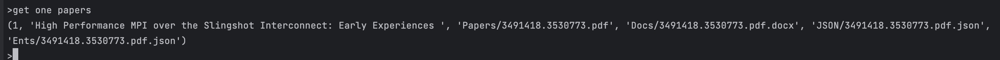
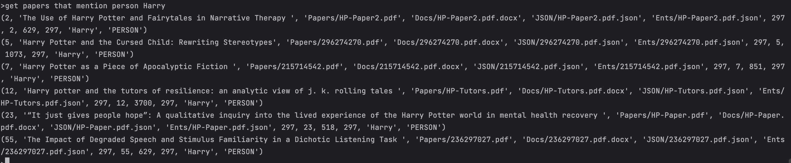
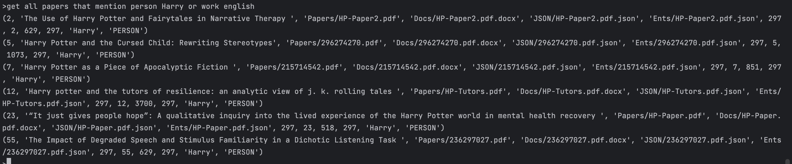
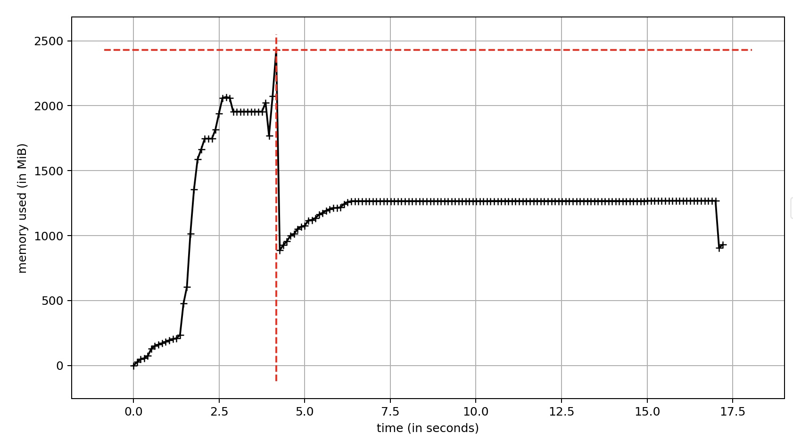

## Analysis and Summary

The main task of this code part is building an original version of document management system. It transfers the contents of documents into texts that can be queried. It offers a command line interface that allows users to execute queries. It reads an Excel file named `index.xlsx` using openpyxl to retrieve data and headers from the `Sheet1` worksheet.

The code processes each row of data and mapping it to a dictionary. This process includes converting PDF files to DOCX format, extracting document content, and saving it in JSON format, as well as identifying and saving entity information. Storing the processed data in three tables within an `SQLite` database: `papers`, `entities`, and `papers_have_entities`.

The overall code provides a command-line interface that allows users to input queries for retrieving documents related to entities.


---

### I. Fuctionality

- 1. **Modules and Library Input**: It uses third-party libraries and modules for document conversion (pdf2docx), text simplification (`simplify_docx`), NLP (`Spacy`), database operations (`SQLite`), and Excel file handling (`openpyxl`).
- 2. **Data Processing and Document Conversion**: The code reads an Excel file named `index.xlsx` and extracts data from the `Sheet1` worksheet. It processes each row, converts PDF files to DOCX format, extracts text content, and saves the content and entity information in JSON format. This is achieved using the `parse` function from the `pdf2docx` library. The code processes each row of data using the table headers and converts it into dictionary format, including paper names, PDF file paths, and other information.The code extracts text content from the converted DOCX file and saves it in JSON format. During this process, the `simplify_docx` library is used to handle text content, such as removing special characters.
- 3. **Database Operations**: The code establishes a SQLite database by opening the `test_db.sqlite` database file. It stores data in three tables within an `SQLite`database:`papers`, `entities`, and `papers_have_entities`.
- 4. **Entity Recognition**: The code uses `Spacy` to identify and save entities from the document contents, such as person names, organization names, and artwork titles; Then the code saves the recognized entity information  in JSON format to a file.
- 5. **User Interface**: It uses the `Prompt Toolkit` library to create an interactive command-line interface that allows users to input queries for retrieving documents related to specific entities.

### II: Defects

#### Hardcode Problem:

This indicates using constant values within the code snippet such as the file directory and the table names. Instead, we could use variables or write them into the configuration files to store these values. For instance, within the code, the file name “index.xlsx”and database names called “papers”and “entities”

#### Lack of Error Handling Mechanism:

For instance, when dealing with some exception problems such as the file is not found, or it fails to connect the sqlite database, the code and the editor won’t output any error messages or handle exceptions. This could lead to abnormal terminations of the program.


#### Lack of User Input Validation and Insufficient Sanitization:

Users can input query strings through the command line, but the code does not perform thorough validation or sanitization of these inputs. This means that users can input any query, including those that may pose security risks. Issue: Insufficient validation and sanitization of user inputs may allow malicious users to execute unsafe queries, such as bypassing permissions or accessing sensitive data. Secure applications typically validate and sanitize user inputs to ensure they do not introduce security issues.

#### SQL String Building:

SQL queries are constructed by concatenating strings, which can introduce the risk of SQL injection. It's safer to use parameterized queries to prevent SQL injection vulnerabilities.

### III: Dependencies:

This code relies on a combination of third-party libraries and modules, including `pdf2docx`, `docx`, `simplify_docx`, `json`, `spacy`, `os`, `sqlite3`, `openpyxl`, and more, to achieve its functionality, including document conversion, NLP tasks, database management, and user interaction. These libraries extend the capabilities of Python and streamline the development process for the intended application.

The database portion of the code utilizes `SQLite`, which necessitates the use of the `sqlite3` module. `SQLite` is a lightweight relational database system often used in small-scale applications due to its simplicity and efficiency.

The Natural Language Processing (NLP) component leverages the `Spacy` library, which provides advanced NLP capabilities. To use `Spacy` effectively, a suitable language model must be downloaded. In this code, the model `"en_core_web_trf"` is used. This model allows for various NLP tasks, such as text processing and entity recognition.

To create an interactive command-line interface for user interaction, the code incorporates the `Prompt Toolkit` library. This library enables the development of user-friendly command-line interfaces and supports features like auto-suggestions, history, and custom completions.


## Performance and correctness test
### 1 Code test
In this part, we will test the overall function of input and output of the code, run and analyze whether the code can successfully complete the entire task.The test environment we used when testing the code this time is as follows:
- Environmental management tools: Conda
- Python version: 3.9.13
- Environment type: virtual environment

In order to ensure the consistency and reproducibility of code test, we used Conda as an environment management tool to configure and activate a specific Python virtual environment. This virtual environment uses Python3.9.13 version.

When we enter the project folder, make sure that the environment configuration is complete and all dependent packages are installed, and then execute the following terminal command to run the program:
```sh
python Prototype.py
```
Then when we see the command line terminal prompt ">",we can enter the query command,for example:
```sh
get one paper
```
The result of output is:

We can also use more complex and precise commands to find the articles we want, for example:
```sh
get papers that mention person Harry
```
And the result is like:

However, if we do not query according to the syntax format required by the program, the program will have no output response. For example, if we enter the following command:
```sh
get papers that mention Harry
```
The result is that the program will not output any query results, even though the above two instructions are semantically the same.

In addition to querying only one entity, we can also query many entities continuously at one time and connect them using “and/or”, such as the following command:
```sh
get all papers that mention person Harry or work english
```
The result of this query is:

So if we want to enter a correct command, we must conform to its basic format syntax 
```sh
get [one/all] papers that mention [person/organisation/work] <entity name> [and/or [person/organisation/work] <entity name> ...]
```

### 2 Code performance analysis
In terms of memory usage when executing code, we choose Python's "memory-profiler" module to analyze. "memory_profiler" is a powerful tool that allows developers to track the memory usage of Python code line by line.
The command to install this module is as follows:
```sh
pip install memory-profiler
```
Run the script using the following command to view memory usage:
```sh
mprof run Prototype.py
```
Then we can get a "mprofile_20231017003245.dat" file, which will display the memory usage line by line.After visualizing this file, you can get the following picture results of memory usage changes:

From the figure, we can see that the memory usage has gone through three stages: rapid increase, rapid decrease, and finally stabilization.

When the program starts running, a large amount of data may be loaded or initialized, causing memory usage to rise sharply. Subsequent memory drops may mean that the program completed some tasks and released related resources. The final stable state may indicate that the program has entered a stable running stage. At this time, the memory usage no longer fluctuates greatly, indicating that the program is performing its main functions normally and does not generate a large amount of new temporary data or leak memory.So from the perspective of memory usage, the performance of the code is relatively stable.

### 3 Code correctness analysis

For the correctness analysis of the entire code, we can conclude by conducting I/O testing on the code that the running results of the entire code are correct and can match the relevant query information.

However, the input query command format still lacks an error handling mechanism, and the robustness of the code should be enhanced.

## Code improvement and infrastructure

Regarding to the prototype we got, there are many aspects we can improve. 

The project structure should be absolutely re-organized and be more manageable. It should be the very first step to deal with. 

Under our project root folder, if we would like go with a web application, we should have:

- **`settings.py`**: Configuration settings for your project, including database configuration
- **`wsgi.py`** and **`asgi.py`**: Entry points for web server interfaces (WSGI and ASGI).

And importantly, the main part:

- **`models.py`**: Defines the database models for the application.
- **`views.py`**: Contains view functions that handle HTTP requests.
- **`urls.py`**: Configures URL routing for the application.
- **`admin.py`**: Provides administrative interface settings.

Thus, the communication with the database we have should be moved to `**models.py`** 

Besides, we have some other folders:

- **`templates/` :** Contains HTML templates used by your Django views.
- **`static/`** : Contains static files such as CSS, JavaScript, images, and other assets.
- **`media/`** : Used to store media files (e.g., user profile pictures, uploaded documents).

`**manage.py`** should be added as a Python script to manage various aspects of a Django project, such as starting a development server, creating new Django applications, running test; instead of running a specific file. It looks like:

```c
#!/usr/bin/env python
"""Django's command-line utility for administrative tasks."""
import os
import sys

def main():
    """Run administrative tasks."""
    os.environ.setdefault('DJANGO_SETTINGS_MODULE', 'myproject.settings')  # Specify your project's settings module.
    try:
        from django.core.management import execute_from_command_line
    except ImportError as exc:
        raise ImportError(
            "Couldn't import Django. Are you sure it's installed and "
            "available on your PYTHONPATH environment variable? Did you "
            "forget to activate a virtual environment?"
        ) from exc
    execute_from_command_line(sys.argv)

if __name__ == '__main__':
    main()
```

And we run:

```c
python manage.py runserver
python manage.py test
```

Last, the `requirements.txt` should be still kept. However, a setup script may do a better job to set the developing environment up, including check and create the virtual environment.

### 1. Improve code readability and maintainability

Comments are good, but most time, especially when our code base is big, they may be annoying. A structured documentation should be created and modified whenever a new fix or update has been done, which illustrates all functionalities and the thoughts why we use that stack or solve that issue. 

Refactoring should be started as soon as possible at the very beginning of the development process, in order to let the project more manageable. The structure has been showed above.

### 2. Make suggestions for optimizing performance and resource usage

In the prototype, it processes the files under the Papers directory and create the database every time. We should skip it once the development environment has been set up and the database is active.