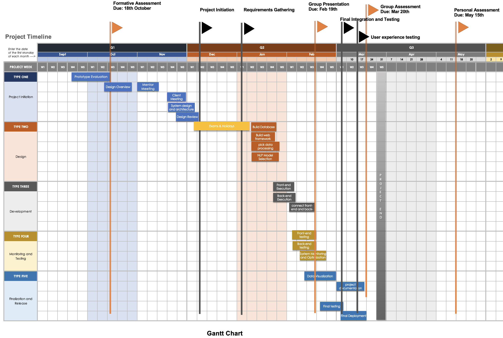

## Project Timeline Explanation

The Gantt chart provided here displays a detailed visual representation of the project schedule for developing a system for the analysis of academic papers and other sources. It outlines the timeline for the project, spanning from September 2023 to May 2024. Here's a detailed explanation of the chart, which is logically organized into phases and tasks:

**Project Initiation Phase (September - October 2023):**

The initiation and requirements gathering phase for the paper analysis system, spanning two weeks from September to October 2023, is a meticulously orchestrated kickoff that lays the foundation for a complex project aimed at enabling researchers and analysts to perform multifaceted analyses on academic papers and news articles. This phase commences with a project kickoff meeting where key stakeholders—including researchers, data scientists, IT personnel, and project managers—converge to align their vision and establish a mutual understanding of the project's ambitious objectives. That is to develop a system capable of authorship, sentiment, theme, and topic analysis.

The estimated two weeks of effort for this phase reflects the intensive nature of the tasks involved, which culminate in a robust project plan that sets the stage for subsequent project phases. This plan takes into account the need for a platform that not only facilitates sophisticated analysis but also encourages the dissemination of findings, sharing of analysis pipelines, and submission of updates or new data, while monitoring data usage for continuous optimization. The success of this initial phase is critical, as it ensures that the project is well-prepared to meet the complex requirements and ambitious goals of creating a dynamic and interactive academic paper analysis system.

Overall, for this phase:

- The project kicks off with an initial Formative Assessment that evaluates the prototype on 18th October. Before this, in September, the team is tasked with evaluating the prototype.
- This phase includes the first two weeks of October for writing design documentation and holding the first mentor meeting, suggesting an iterative agile approach to project management.
- A client meeting is scheduled in the third week of October, which indicates stakeholder engagement early in the project.
- The final week of October is reserved for requirement analysis, which is critical for understanding the needs for the data ingestion, analysis, and visualization components of the system.

**Requirement Gathering and Prototype Design (October - December 2023):**

During this concentrated two-week system prototype design phase, from October to December 2023, our team undertakes the intricate task of crafting a scalable and modular architecture for our paper analysis system, a task that follows closely on the heels of an intensive requirement gathering phase that includes iterative prototype design. The system is meticulously planned to handle the complexities of ingesting, storing, querying, processing, and visualizing a vast array of academic papers and news sources. We start by conducting a thorough system analysis to define a modular architecture that not only meets current analysis requirements but is also flexible enough to accommodate future enhancements, such as specialized processing pipelines for technology and model identification.

This phase's effort, estimated to involve the expertise of system architects and senior developers, hinges on aligning the intricate system design with the nuanced requirements gathered from stakeholders, informed by the feedback from the initial prototype evaluations. The design process incorporates planned downtimes, such as a revision break and holidays, ensuring a realistic and sustainable project schedule. The resultant architecture blueprint promises a robust foundation for a cutting-edge system that caters to the diverse and evolving needs of the academic research community, facilitating deep analytical dives into the wealth of knowledge contained within academic literature and beyond.

Overall, within this phase:

- After the formative assessment, our team moves into an intensive requirement gathering phase, which overlaps with the start of prototype design.
- The task of reviewing and revising the design suggests that our team is refining the initial prototype based on feedback, which is a key aspect of user-centered design.
- During this period, it also includes a break for revision and holidays, indicating project downtime, which is important for realistic scheduling.

**Development Phase (November 2023 - January 2024):**

A major chunk of development occurs from November to February, where we see tasks such as building a web framework, selecting an NLP (Natural Language Processing) toolkit, and setup our database.

- This phase is also when the actual coding takes place, indicated by tasks like front-end design, back-end interface, and concurrent testing. This aligns with the creation of a data store and query layer mentioned in the project description.
- The overlap of front-end and back-end tasks suggests a parallel development approach, increasing efficiency and reducing time to market.

**Testing and Refinement (January - February 2024):**

The group presentation on February 20th marks a significant milestone, where the progress is likely to be reviewed and shared.

- Following this, a period of intense testing begins, including front-end testing, back-end testing, and interactive testing.
- The focus then shifts to optimization and improvement, which is essential for ensuring the system's performance and reliability.
- The chart indicates an iterative process of testing and refinement, which is crucial for a system handling complex data analysis.

**Finalization and Release (March 2024):**

Early March is a critical month for the project with the final testing of the beta version, preparing for the release of the Minimum Viable Product (MVP).

- The MVP release, marked by a star, is a key milestone, suggesting that the system will be ready for initial user feedback and real-world use.
- After the MVP, the team focuses on a beta version, indicating a phase of user testing and gathering feedback for further improvement.
- The project concludes with a group assessment and user testing in March, followed by the final version's release in May, marked by the personal assessment on 15th May.

Overall, our group Gantt chart illustrates a structured and phased approach to the project, with clear milestones and deliverables. It reflects a logical sequence of design, development, testing, and refinement activities, leading up to the release of the system. The timeline incorporates important assessments, both formative and summative, ensuring ongoing evaluation and improvement of the project's outputs. Additionally, the chart factors in team presentations and assessments, reflecting an emphasis on collaboration and stakeholder engagement throughout the project lifecycle.
